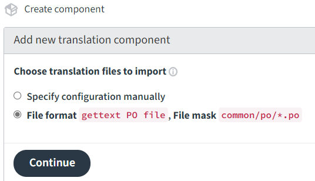
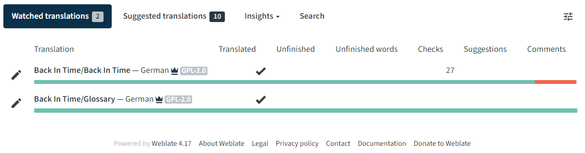

# Translation and localization (l10n) of Back In Time using Weblate
<sub>Feel free to [open issues](https://github.com/bit-team/backintime/issues) or contact the [maintenance team on the mailing list](https://mail.python.org/mailman3/lists/bit-dev.python.org/) if this text is difficult to understand or not helpful.</sub>

## Index

<!-- TOC start https://ecotrust-canada.github.io/markdown-toc/ -->
- [Quick guide: Synchronize translations between Weblate and Microsoft GitHub](#quick-guide-synchronize-translations-between-weblate-and-microsoft-github-upstream-repository)
- [Introducing the localization process](#introducing-the-localization-process-in-the-back-in-time-project)
- [Transfer translatable strings onto Weblate platform](#transfer-translatable-strings-onto-weblate-plattform)
- [Transfer back translation from Weblate into Back In Time upstream repository](#transfer-back-translation-from-weblate-into-back-in-time-upstream-repository)
- [Setup Weblate project](#setup-weblate-project)
<!-- TOC end -->

That file **does not** describe how to use the [GNU gettext
utilities](https://www.gnu.org/software/gettext/manual/html_node/index.html)
to localize software.

# Quick guide: Synchronize translations between Weblate and Microsoft GitHub upstream repository

> [!WARNING]
> Do not follow this steps if you are new to this process! Please go to the next section and start reading from there.

The following steps are a quick reminder for maintainers of _Back In
Time_. The goal is to synchronize the state of the ongoing translation at
Weblate and the modified py-files in the upstream repository at Microsoft
GitHub.

1. Weblate ["Repository maintenance"](https://translate.codeberg.org/projects/backintime/#repository):
    1. Press "Commit".
    2. "Lock" the project.
2. git: Start a new branch.
3. Download and integrate Weblate into the git repository via `./update_language_files.py weblate`.
4. Check via `git status` or `git diff`. The `po`-files (not `pot`!) in `common/po` and the file `common/languages.py` should be modified.
5. Commit.
6. Scan `py`-files for modified source strings via `./update_language_files.py source`.
7. Check via `git status` or `git diff`. The file `messages.pot` and all `po`-files should be modified.
8. Commit.
9. Optional: Check for redundant letters in "shortcut groups" via `./update_language_files.py shortcuts`.
10. Create PR and merge into "dev".
11. Weblate ["Repository maintenance"](https://translate.codeberg.org/projects/backintime/#repository):
    1. Go to "Danger zone" and click on "Reset".
    2. "Unlock" the project.

# Introducing the localization process in the Back In Time project

## Some facts

- A translation platform (Weblate in this case) is not for developers but for the users. It's purpose is to make it easy as possible for contributors to translate strings without knowing technical details about code, Git or GNU gettext. The platform is not part of an automatic build pipeline and does not run the GNU gettext utilities for you.
- The Weblate instance on [translate.codeberg.org](https://translate.codeberg.org) do not support integration with external code hoster (state: May '23). This is not a restriction of Weblate itself but of Codeberg.org. The practical consequences are that it isn't possible to create pull request or to push directly (or automatically) from Weblate to Microsoft GitHub. This may change in the future.
- The [GNU gettext](https://www.gnu.org/software/gettext/manual/html_node/index.html) system is used for localization. Strings in python files enclosed by `_(...)` are recognized as translatable.
- Despite _Back In Time_ is separated into the two components `common` and `qt` the localization is not. All `po` and `pot` files are located in the folder `common/po` and used by the second component `qt` also.
- All actions should doable with the script `update_language_files.py` and there is no need to directly run one of the _GNU gettext utilities_. Some technical details are documented in the mentioned script.
- The current setup do not follow "modern recommendations" and may get optimized in the future.
- The "compilation" of `po` files into `mo` files is a separate step not described in this document. It is part of the [install and build process](../../CONTRIBUTING.md#build--install).

## Brief description of steps in the process

1. Scan all python files (in `common` and `qt` excluding `test_*.py`) for translatable strings and store them into the _message template file_ `common/po/message.pot`.
2. Synchronize that _message template file_ with the existing translations (`common/po/*.po`).
3. Commit and push the modifications into the development branch (e.g. `dev`).
4. The Weblate platform do pull that changes from our upstream repository into its own internal repository (manual triggered by maintainers or automatically).
5. Now the contributors can translate using our [Weblate "Back In Time" project](https://translate.codeberg.org/projects/backintime/). There is also a [translation landing page](https://translate.codeberg.org/engage/backintime).
6. The translations on Weblate (as `po` files) need to be committed (manual or automatically) into the Weblate repository.
7. The `po` files with fresh translations are downloaded (via `git clone`) from the Weblate repository and copied into the BIT upstream repository.
8. Check the modifications in upstream and commit them into development or feature branch.

Step 1, 2, 7 and 8 are done via `update_language_files.py` which is a wrapper for _GNU gettext utilities_ and Git tools.

# Transfer translatable strings onto Weblate platform

Add or modify strings to translate. In this example the string `Translate me please.` is translatable because it is enclosed by `_(...)`:

```python common/backintime.py
if __name__ = '__main__':
    print(_('Translate me please.'))
    startApp()
```

Run `./update_language_file.py` with the argument `source` to scan get the new and modified strings into the _message template file_ (`common/po/messages.pot`) and also update the _language files_ (`*.po`).

```
$ ./update_language_files.py source
Updating PO template file "common/po/messages.pot" ...
  Execute "pygettext3 --verbose --output=common/po/messages.pot common/*.py qt/*.py"
Working on common/backintime.py
Working on common/password.py

...snipped...

Please check the result via "git diff".
```

Let's look into the modifications. The _message template file_ include the new string now as a `msgid`.

```diff
diff --git a/common/po/messages.pot b/common/po/messages.pot
index 6b690204..e7bab701 100644
--- a/common/po/messages.pot
+++ b/common/po/messages.pot
@@ -15,6 +15,10 @@ msgstr ""
 "Generated-By: pygettext.py 1.5\n"


+#: common/backintime.py:1196
+msgid "Translate me please."
+msgstr ""
+
 #: common/config.py:95
 msgid "Disabled"
 msgstr ""

```

All _language files_ are also update with that new string. Here the `de.po` file as an example:

```diff
diff --git a/common/po/de.po b/common/po/de.po
index 68dc7795..b6e07b50 100644
--- a/common/po/de.po
+++ b/common/po/de.po
@@ -19,6 +19,10 @@ msgstr ""
 "X-Generator: Weblate 4.17\n"
 "X-Launchpad-Export-Date: 2022-11-06 19:32+0000\n"

+#: common/backintime.py:1196
+msgid "Translate me please."
+msgstr ""
+
 #: common/config.py:95
 msgid "Disabled"
 msgstr "Deaktiviert"
```

In the end those changes need to arrive in the `dev` branch to get recognized by the Weblate translation platform. Create a Pull Request or commit/merge and push.

If the project at Weblate is correctly setup it does recognize the new commit automatically and update its internal git repository. See this in _Manage_ / _Repository maintenance_ section:


Looking into the list of languages there is one new (untranslated) string in _German_:


As an example the string get translated.


Go to the next section to see how to integrate the translation back to the upstream repository.

# Transfer back translation from Weblate into Back In Time upstream repository

The starting situation is that some strings are translated by contributors on the Weblate platform. Go to _Manage_ / _Repository maintenance_ section. The counter for _Pending changes not yet committed to the Weblate repository_ should be 1 or more. Click on _Commit_ that counter goes back to 0 but now the _Outgoing commits in the Weblate repository_ are increased. There is also a difference between the _Last remote commit_ and _Last commit in Weblate_:


Go back to your local repository and run the known `update_language_files.py` script with `weblate` as argument:

```sh
./update_language_files.py weblate
Execute "git clone --no-checkout https://translate.codeberg.org/git/backintime/common /tmp/tmpbbv11b11".
Klone nach '/tmp/tmpbbv11b11' ...
remote: Enumerating objects: 353, done.
remote: Counting objects: 100% (353/353), done.
remote: Compressing objects: 100% (163/163), done.
remote: Total 353 (delta 177), reused 320 (delta 166), pack-reused 0
Empfange Objekte: 100% (353/353), 1.31 MiB | 5.41 MiB/s, fertig.
Löse Unterschiede auf: 100% (177/177), fertig.
Execute "git --git-dir /tmp/tmpbbv11b11/.git checkout dev -- common/po/*.po".
Please check the result via "git diff".
```

The script downloaded the `po` files with fresh translations directly from Weblate (via `git clone`) and copied them in the local repository. In result `git diff` shows that the German language file was updated with the translation:

```diff
diff --git a/common/po/de.po b/common/po/de.po
index b6e07b50..f2b73be4 100644
--- a/common/po/de.po
+++ b/common/po/de.po
@@ -7,7 +7,7 @@ msgstr ""
 "Project-Id-Version: Back In Time 0.9.5\n"
 "Report-Msgid-Bugs-To: \n"
 "POT-Creation-Date: 2023-05-04 16:31+0200\n"
-"PO-Revision-Date: 2023-05-02 21:26+0000\n"
+"PO-Revision-Date: 2023-05-04 14:59+0000\n"
 "Last-Translator: buhtz <c.buhtz@posteo.jp>\n"
 "Language-Team: German <https://translate.codeberg.org/projects/backintime/"
 "common/de/>\n"
@@ -21,7 +21,7 @@ msgstr ""

 #: common/backintime.py:1196
 msgid "Translate me please."
-msgstr ""
+msgstr "Übersetze mich bitte."

 #: common/config.py:95
 msgid "Disabled"
```

Just `commit` the changes to the repository.

Keep in mind: To make the translation appear in the running _Back In Time_ the `po` files need be compiled to `mo` files. This is done in the build (packaging) and install process which is described [elsewhere](../../CONTRIBUTING.md#build--install).

# Setup Weblate project

The setup was done in 2023. This section is only for documentation of what was done at that time. For demonstration purpose in the screenshots the BIT upstream repository is not used but a fork of it.

First login into [translate.codeberg.org](https://translate.codeberg.org) which is the Weblate instance hosted by [Codeberg.org](https://codeberg.org). Use the plus sign in the top right corner to _Add new translation project_.


Insert the needed information's and press _Save_.


Weblate differentiate between _Project_ and _Component_. One project can have several components. In the first place there is no _Component_. Press _Add new translation component_.


Insert the follow information's about the component.


Press _Continue_ and wait until Weblate has scanned the repository. Weblate do recognize the structure of the repository and the location of the relevant files. Choose the second option with _File mask_ `common/po/*.po`.



Modify nothing on the next screen. Just push _Save_ and wait while _Component is being updated..._.


Ignore the next page _Community localization checklist_ and all the red signs on it. Everything is fine. Now looking into the _Dashboard_:



Clicking on the component the status of all languages is shown:


Finally a Webhook need to be setup. This enables Weblate to be automatically informed about new commits at the upstream repository. The Webhook need be installed, not on Weblate, but at the upstream repository _Settings_ at Microsoft GitHub. Just use the _Payload URL_ `https://translate.codeberg.org/hook/gitea`:


<sub>January 2024</sub>
