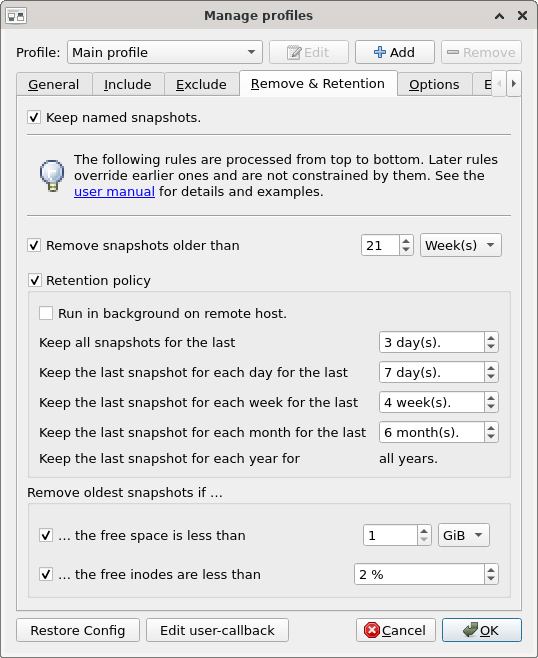
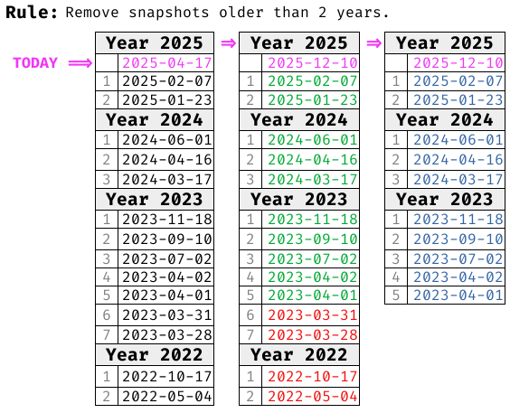
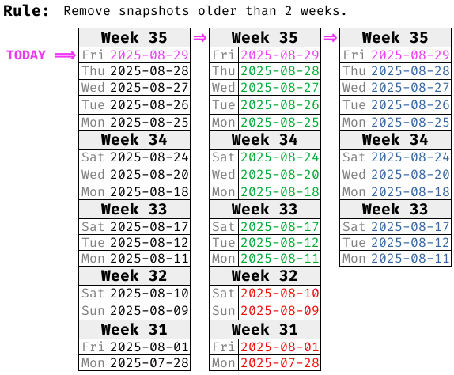
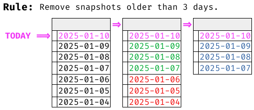

# Remove & Retention
<!--
SPDX-FileCopyrightText: © 2025 Christian Buhtz <c.buhtz@posteo.jp>

SPDX-License-Identifier: GPL-2.0-or-later

This file is part of the program "Back In Time" which is released under GNU
General Public License v2 (GPLv2). See LICENSES directory or go to
<https://spdx.org/licenses/GPL-2.0-or-later.html>
-->
## Overview
Snapshots can be automatically deleted or retained based on rules.
These rules allow for fine-grained management of the backup archive,
reducing storage space usage. The process runs at the end of every snapshot
run, if no new snapshot is created.

!!! note
    The feature was also known as _Auto-remove_ or _Smart Remove_ in earlier
    versions of _Back In Time_ (prior to 1.6.0).

Here is a brief overview of the rules available:

      
- **Keep named snapshots**: All snapshots with a name are excluded from every
  rule and never removed. This is the only one rule that can not be overruled
  by other rules.
- **Remove snapshots older than `N` Days/Weeks/Years**: Snapshots older than
  the specified time period are removed immediately.
- **Retention policy**: A batterie of rules about which snapshots to keep. The
  rest will be removed immediately.
    - **Keep all snapshots for the last `N` days**
    - **Keep the last snapshot for each day/week/month for the last `N` days/weeks/months**
    - **Keep the last snapshot for each year for all years**
- **Remove oldest snapshot if the free space is less than `N` GiB/MiB**: If the
  threshold of free storage space is reached, the oldest snapshots will be
  removed until enough storage space is available again.
- **Remove oldest snapshot if the free inodes are less than `N` %**: If the
  threshold of free inodes is reached, the oldest snapshots will be
  removed until enough inodes are available again.

!!! warning
    All rules are processed from top to bottom, as presented in the GUI or in
    this manual. Later rules **do override** earlier ones and are **not
    constrained** by them. The only exception is the first rule
    *Keep named snapshots*.

## Rules in details
### Keep most recent snapshot
The most recently created snapshot, in other words the freshest one, will be
retained and not deleted by any of the configured rules.

### Keep named snapshots
Beside the timestamp regularly used to identify snapshots, it is possible to
attach a name to it. Those named snapshots are never touched by any other
rule. It is a guarantee that they won't be removed. See
[Main Window](main-window.md) for more details about named snapshots.

### Remove snapshots older than `N` Days/Weeks/Years
#### Year
- Calculation is based on 12 months.
- Current months is ignored.
- _Example_: Older than two years, at date 2025-04-17, result in
removing backups before (or older than) 2023-04-01.

#### Week
- Calculation is based on calendar weeks with Monday as first day of a week.
- Current week is ignored.
- _Example_: Older than two weeks, at Friday 2025-08-29, result in removing
  backups before (or older than) Monday 2025-08-11.

#### Day
- Calculation is based on full days ignoring time at day.
- Current day is ignored.
- _Example_: Older than 3 days, at date 2025-01-10, result in removing backups
  before (or older than) 2025-01-07.

### Retention policy
Snapshots are retained if they fit the rules, but the rest will be removed.

## Interactions between and mutual constraints of the rules
...

## --Notizen--
- Das gerade angefertigte Backup (`new_snaphshot`) wird ignoriert und nicht
  gelöscht. Siehe `listSnapshots()` und den default Wert `False` für
  `includeNewSnapshot`.
- _Remove snapshots older than_ : Ist nur ein Backups in der Liste wird er
  nicht gelöscht. In Verbindung mit dem vorherigen Punkt
  (`includeNewSnapshot=False`) bleiben also immer mind. zwei Backups erhalten.
- Mention "Run in background mode on remote host." on SSH profiles
